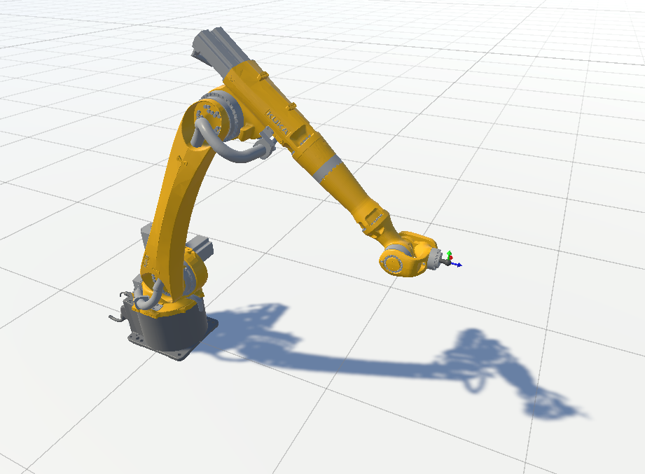

# DESCRIPTION
Simple program that contains Kuka robot arm with 6 motors, for which inverse kinematics are alculated.



# USAGE
- After entering play mode switch back to scene view.
- At scene view select ```GoalPoint``` object from object's list on the left and move it around.
- Robot arm will be following this point's position and orientation.

This unconventional usage is due to intention of connecting this robot or similar one to some input or other object in the scene.